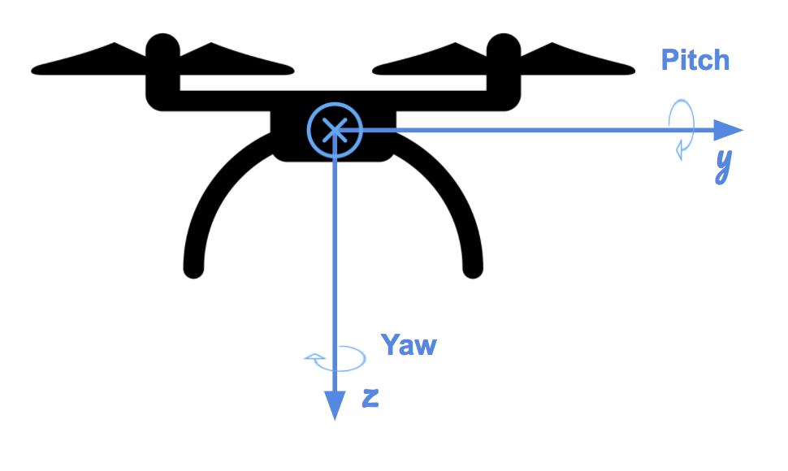

#  The FCND C++ Project. Control of a 3D Quadrotor
Udacity Flying Car Nanodegree, Term 1 - Project 3.

<p align="center">

</p>

- - -

## Overview ##

###Simplified model of the 2D drone.###
<p align="center">

</p>


###3D Drone dynamics ###
Drone can move along the three position axis  *X* ,  *Y* and  *Y* . *Z*  axis is directed downward The drone can roll along the *X* axis, pitch along the *Y* axis and yaw along the *Z* axis. The directions of the rotations are depicted in the images above.


<p align="center">

</p>

**NOTE:** Rotor's order is different in the code data structure.

###3D Cascading PID controller ###
The detailed explanation about feed-forward cascading PID controller design can be find in the [Angela P. Schoellig] paper [Feed-Forward Parameter Identification for Precise Periodic uadrocopter Motions](http://www.dynsyslab.org/wp-content/papercite-data/pdf/schoellig-acc12.pdf)
Controller consists of altitude controller, position controller, and attitude controller.

<p align="center">

</p>

The attitude controller breaks down into smaller controllers responsible for roll-pitch, yaw, and body rate.

<p align="center">

</p>

##Implementation ##

In the project repository structure [/cpp](./cpp) is the home folder for C++ code. Implemetation files are:

- [/cpp/src/QuadControl.cpp](./cpp/src/QuadControl.cpp) -  This is the file where I have implemented coding tasks.
- [/cpp/config/QuadControlParams.txt](./cpp/config/QuadControlParams.txt) - Drone parameters configuration file with tuned values.

### Coding Tasks ###

####Body rate control.###
Class memeber function :```V3F QuadControl::BodyRateControl(V3F pqrCmd, V3F pqr)```
Code implemented *P Controller* with moment of inertia.`kpPQR`  - should be tuned for making it work.

*Moment_cmd = I *\** Kp *\** err*

*I* - Moment of inertia
*Kp* - Proportional gain
*err* - difference beteween targeted (desired) and actual values


####Roll pitch control.####
Class memeber function :```V3F QuadControl::RollPitchControl(V3F accelCmd, Quaternion<float> attitude, float collThrustCmd)```
The roll-pitch controller is a P controller responsible for commanding the roll and pitch rates ( *pcpc  and  qcqc* ) in the body frame. First, it sets the desired rate of change of the given matrix elements using a P controller.

**Note:** subscript "c" means "commanded" and "a" means "actual"

<p align="center">

</p>

<p align="center">

</p>


####Altitude controller.####
Class memeber function :```float QuadControl::AltitudeControl(float posZCmd, float velZCmd, float posZ, float velZ, Quaternion<float> attitude, float accelZCmd, float dt)```


<p align="center">

</p>


####Lateral position control.####
Class memeber function :```V3F QuadControl::LateralPositionControl(V3F posCmd, V3F velCmd, V3F pos, V3F vel, V3F accelCmdFF)```

The lateral controller uses a PD controller to command target values for elements of the drone's rotation matrix. The drone generates lateral acceleration by changing the body orientation which results in non-zero thrust in the desired direction.
The control equations have the following form:

<p align="center">

</p>

####Yaw control.####
Class memeber function :```float QuadControl::YawControl(float yawCmd, float yaw)```

Control over yaw is decoupled from the other directions. A P controller is used to control the drone's yaw.

<p align="center">

</p>

Yaw value is constrained to be in range [-Pi, Pi]
 
####Calculating the motor commands for given commanded thrust and moments.####
Class memeber function :```VehicleCommand QuadControl::GenerateMotorCommands(float collThrustCmd, V3F momentCmd)```
For finding motor commands we have to resolve system of equations:
*F1 - F2 - F3 + F4 =   Moment_x / l
 F1 + F2 - F3 - F4 =   Moment_y / l
 F1 - F2 + F3 - F4 = - Moment_z / k
 F1 + F2 + F3 + F4 =   Total_thrust*
 Where "*l*" is the perpendicular ditsance of motors from the masss center (Z axis). We assume our drone is a cross shaped so we can calculate this value from arm's length: *l = Arm_Length / sqrt(2)* .
 **Note:** Motor's order in the equations is different form their index in the command's array.

###Flight evaluation (Testing)###
####Scenario 0 (intro)####

<p align="center">

</p>

```
PASS: ABS(Quad.PosFollowErr) was less than 0.500000 for at least 0.800000 seconds
```

####Scenario 1 (Altitude Control)####

<p align="center">

</p>

```
PASS: ABS(Quad.Roll) was less than 0.025000 for at least 0.750000 seconds
PASS: ABS(Quad.Omega.X) was less than 2.500000 for at least 0.750000 seconds
```

####Scenario 2 (Postion Control)####

<p align="center">

</p>

```
PASS: ABS(Quad1.Pos.X) was less than 0.100000 for at least 1.250000 seconds
PASS: ABS(Quad2.Pos.X) was less than 0.100000 for at least 1.250000 seconds
PASS: ABS(Quad2.Yaw) was less than 0.100000 for at least 1.000000 seconds
```
####Scenario 3 (Non-idealities)####

<p align="center">

</p>

```
PASS: ABS(Quad1.PosFollowErr) was less than 0.100000 for at least 1.500000 seconds
PASS: ABS(Quad2.PosFollowErr) was less than 0.100000 for at least 1.500000 seconds
PASS: ABS(Quad3.PosFollowErr) was less than 0.100000 for at least 1.500000 seconds
```
####Scenario 4 (Trajectory followings)####

<p align="center">

</p>

```
PASS: ABS(Quad2.PosFollowErr) was less than 0.250000 for at least 3.000000 seconds
```


